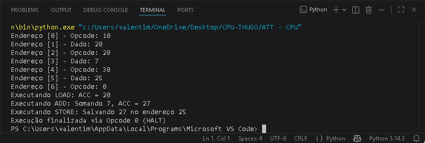

# Simulador de CPU (Arquitetura de Von Neumann)

Este projeto foi desenvolvido como parte de um trabalho acadêmico para a disciplina de Organização e Arquitetura de Computadores. A ideia foi criar um simulador funcional em Python que replicasse o comportamento básico de um processador seguindo o modelo de Von Neumann.

## O Projeto
O script simula o ciclo de instrução (Fetch-Decode-Execute). No código, implementei a lógica da Unidade de Controle e da ULA para gerenciar o que acontece com os dados dentro do Acumulador (ACC) e como o Contador de Programa (PC) avança pela memória.

### O que o simulador trata:
* Manipulação direta de registradores (ACC e PC).
* Execução de instruções como carga de memória, soma e subtração.
* Visualização do estado da memória principal durante o processo.

## Arquivos
* **Codigo Fonte:** [cpu-von-neumann.py](./cpu-von-neumann.py)
* **Artigo Academico:** [Ler Artigo Completo (PDF)](./Simulacao%20de%20uma%20CPU%20em%20Pyhton%20baseada%20na%20Arquitetura%20de%20Von%20Neumann.pdf)

## Exemplo de execução
Tirei um print do terminal para mostrar como o simulador imprime o passo a passo de cada instrução sendo executada:

---
**Autor:** Samuel Valentim de Souza  
**Curso:** Engenharia da Computação - AFYA Itaperuna 
